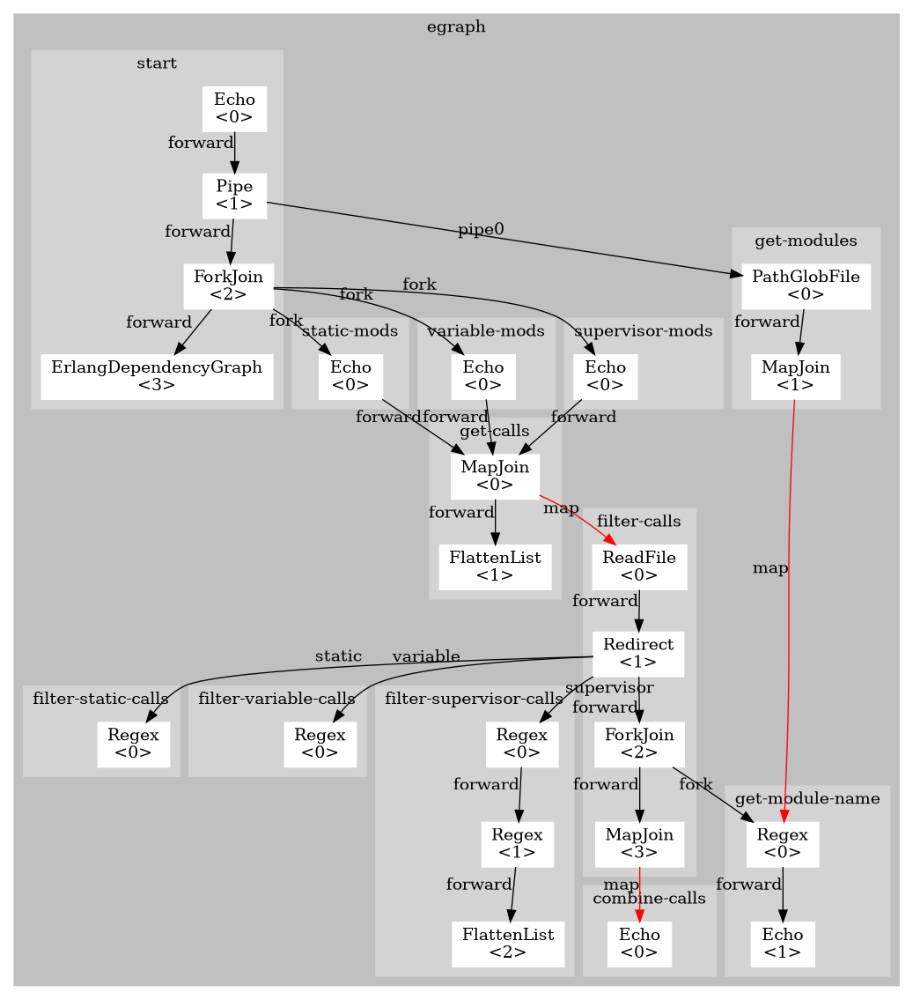

# Erlang module dependency generator

Define source location in `egraph.args` appropriately.
Macros can be set, too (see example configurations).

# Control Flow Graph

# Quickstart Docker

1. Bind your source folder in `docker-compose.yml`
2. Execute `docker-compose up`
