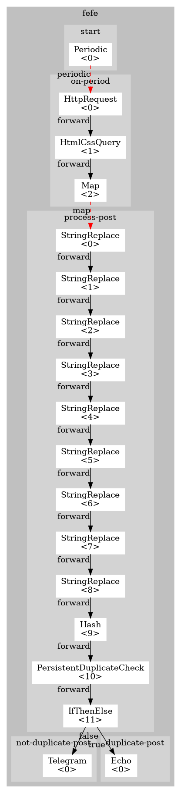

Monitors blog.fefe.de and sends new blog postings via a telegram bot to a telegram user.

Does not crash or resend a blog post on failure to send a telegram message.

Make sure to set the 'bot-token' key and 'recipient' key correctly.

To fix the keys on startup, create a 'fefe.args' file and define these two keys there:

```
bot-token="..."
recipient="..."
```

To start this workflow, execute `scraper` in the same directory as `fefe.yf`. 
If it is not the only `yf` file, execute `scraper fefe.yf`instead.

# Dependencies

* [Unstable nodes](https://github.com/scraperflow/scraper-nodes/releases/tag/unstable-v0.3.0)
* [Dev nodes](https://github.com/scraperflow/scraper-nodes/releases/tag/dev-v0.5.0)

# Flow Graph:



# Quickstart Docker:

1. Set `bot-token` to your telegram bot token and `recipient` to your recipient ID
2. Make sure you can receive messages from your telegram bot
3. Use `docker-compose up` to start the workflow
